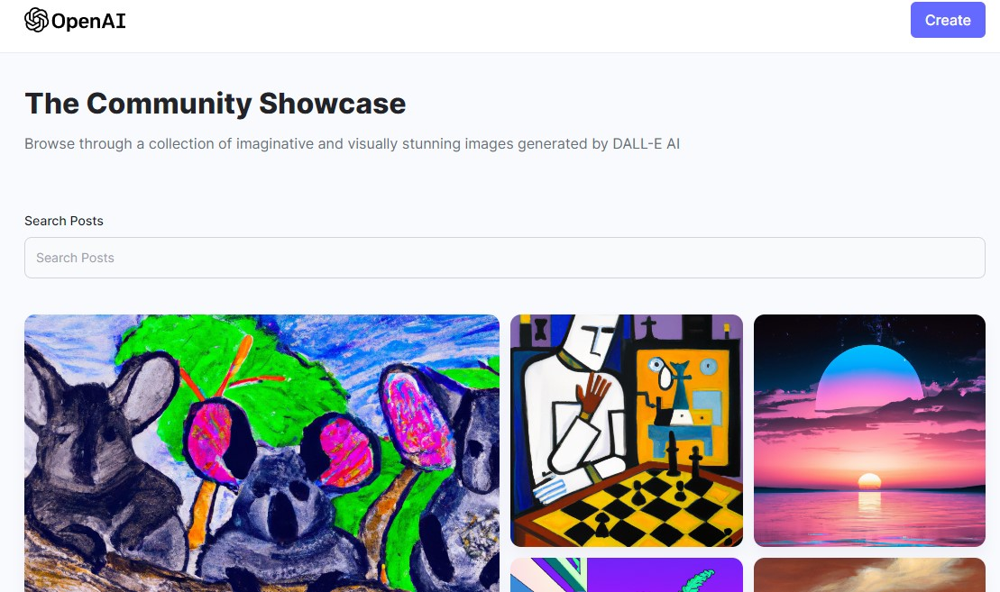

# AI Image generator powered by OpenAI's DALL-E

Try it out! https://generate-images.com

Mern stack application to generate images based on any entered prompts. Also share your image with the community, and download any image from the homepage.

To install:
  - clone the repo
  - install node modules in both the client and server directory
  - create a .env file with the following credentials: 
  
    -  OPENAI_API_KEY=
    -  MONGODB_URL=
    -  CLOUDINARY_CLOUD_NAME=
    -  CLOUDINARY_API_KEY=
    -  CLOUDINARY_API_SECRET=
  - You will have to obtain an api key from both OpenAI and Cloudinary
   
   

  
